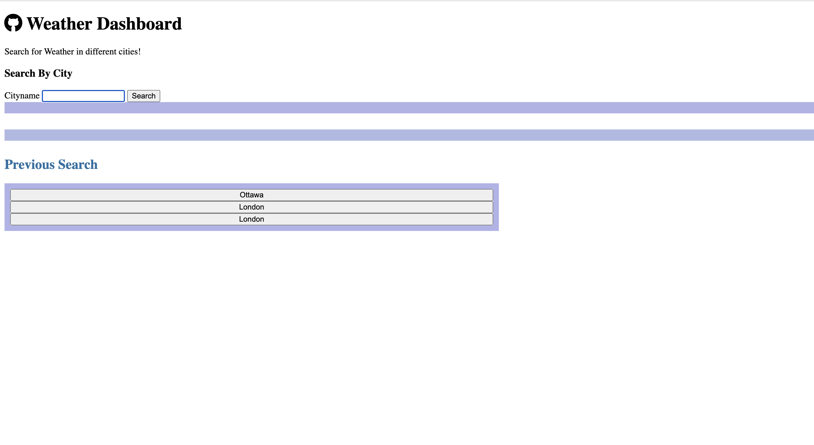
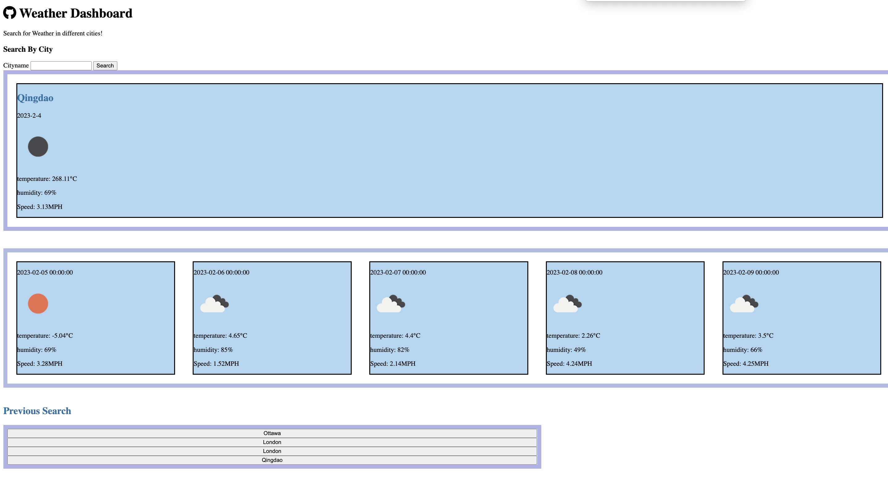

# 06 Server-Side APIs Challenge: Weather Dashboard

## Description

- This project enables the audience to search multiple cities' weather. 

## Usage

- Users can search weather for multiple citiews in current day, as long as weather in five days. Also, everytime users search for a city, the city is added to search history. When users click on a city in the search history, then, they are again presented with current and future conditions for that city. 

## Images

## deployed application

[application link] (https://jennyzzhh.github.io/Module6-Weather-Dashboard/)

[Github link] (https://github.com/Jennyzzhh/Module6-Weather-Dashboard.git)

